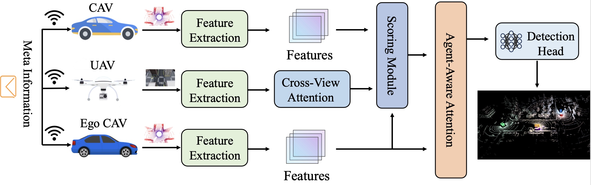
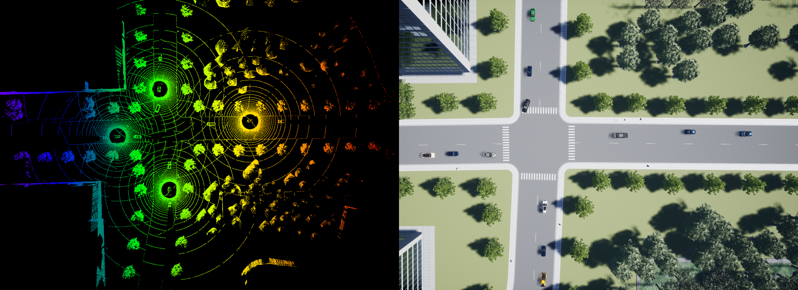
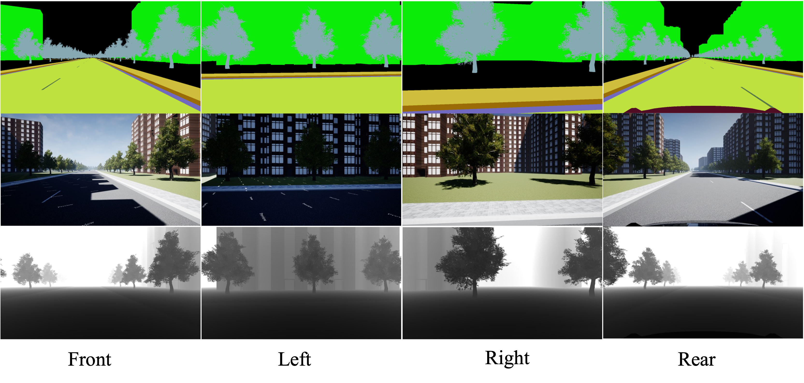

<div align="center">

# VVSim: A Large-Scale Aerial-Ground Dataset and Benchmark for Cooperative Perception (ECCV 2026)

**Zengle Zhu, Zhen Li, Tianyi Huai, Tianshun Li, Zihang Xu, Liuqing Yang, Rongqing Zhang, Xinhu Zheng**

[[Installation]](./docs/get_started.md)
[[Data Preparation]](./docs/vvsim.md)
[[Dataset]](https://huggingface.co/datasets/LOTEAT/VVSim/tree/main)
[[License]](./LICENSE)



<p><em>The framework of VVFormer.</em></p>

</div>

## Introduction

This repository contains the official implementation of `VVFormer`, the
benchmark model released with our ECCV 2026 paper
**"VVSim: A Large-Scale Aerial-Ground Dataset and Benchmark for Cooperative
Perception"**.

Built on PyTorch and the OpenMMLab stack, `VVDetection3D` provides:

- dataset preprocessing tools for `VVSim`,
- model components for aerial-ground cooperative 3D perception,
- training and evaluation pipelines for LiDAR-camera cooperative detection.

## Visualization

<div align="center">
  <table>
    <tr>
      <td align="center"></td>
      <td align="center"></td>
    </tr>
    <tr>
      <td align="center"><em>UAV view</em></td>
      <td align="center"><em>Vehicle view</em></td>
    </tr>
  </table>
</div>

## Highlights

- Official `VVFormer` training and evaluation pipeline for `VVSim`.
- End-to-end `VVSim` preprocessing, including metadata generation.
- Reusable collaborative 3D perception codebase built on `MMDetection3D`.
- Apache 2.0 licensed research code for aerial-ground cooperative perception.

## Installation

Please follow the full environment setup guide in
[docs/get_started.md](./docs/get_started.md).

Quick setup:

```shell
conda create -n vvdet3d python=3.8 -y
conda activate vvdet3d

pip install -U openmim
mim install "mmengine==0.10.7"
mim install "mmcv==2.0.0rc4"
mim install "mmdet==3.3.0"

pip install -r requirements/runtime.txt
pip install -v -e .
```

## Dataset

The raw `VVSim` archives are hosted on Hugging Face:

<https://huggingface.co/datasets/LOTEAT/VVSim/tree/main>

After downloading and extracting the dataset under `data/vvsim`, generate the
metadata files with:

```shell
python tools/create_data.py vvsim \
  --root-path ./data/vvsim \
  --out-dir ./data/vvsim \
  --extra-tag vvsim \
  --workers 64
```

Detailed dataset structure and preprocessing instructions are available in
[docs/vvsim.md](./docs/vvsim.md).

## Training

The current `VVFormer` configuration provided in this repository is:

```text
configs/vvformer/vvformer_hv_secfpn_sbn-all_8xb4-2x_vvsim-3d.py
```

Train with:

```shell
python tools/train.py configs/vvformer/vvformer_hv_secfpn_sbn-all_8xb4-2x_vvsim-3d.py
```

Current limitation: training is currently supported on a single GPU with
`batch_size=1`.

## Evaluation

Evaluate a trained checkpoint with:

```shell
python tools/test.py configs/vvformer/vvformer_hv_secfpn_sbn-all_8xb4-2x_vvsim-3d.py /path/to/checkpoint.pth
```

## Citation

If you find `VVSim` or `VVFormer` useful in your research, please cite:

```bibtex
@inproceedings{zhu2026vvsim,
  title={VVSim: A Large-Scale Aerial-Ground Dataset and Benchmark for Cooperative Perception},
  author={Zengle Zhu and Zhen Li and Tianyi Huai and Tianshun Li and Zihang Xu and Liuqing Yang and Rongqing Zhang and Xinhu Zheng},
  booktitle={Proceedings of the European Conference on Computer Vision (ECCV)},
  year={2026}
}
```

## Acknowledgement

This project builds on the open-source efforts of `MMDetection3D` and
`OpenCOOD`. Their tooling, design ideas, and community support made this
repository possible.

## License

This project is released under the [Apache 2.0 license](./LICENSE).
